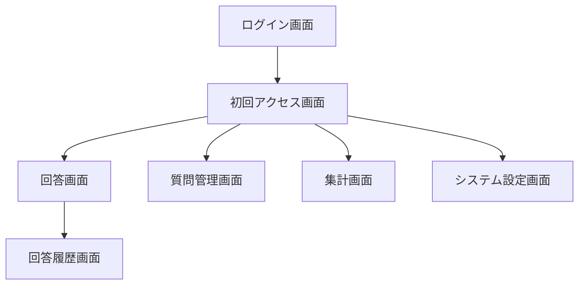
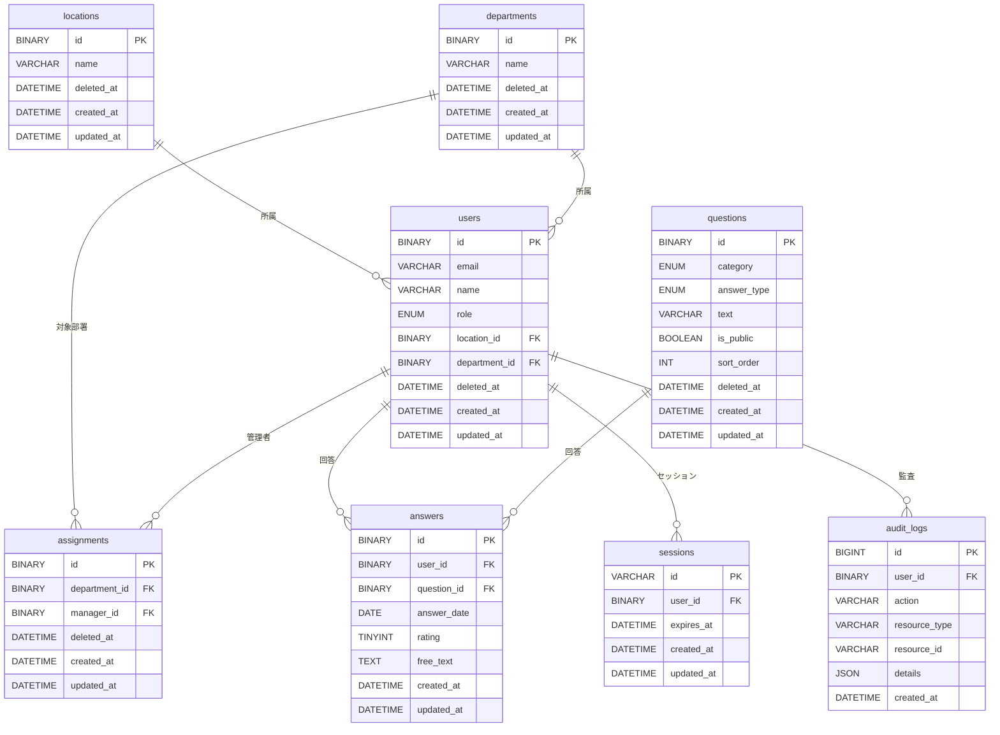

# 基本設計書

## 1. 概要

### 1.1 ドキュメントの目的

本ドキュメントは、要件定義書で定義した機能・非機能要件を実現するための基本設計を記述する。

### 1.2 参照ドキュメント

- 要件定義書（本設計書は要件定義書の機能・非機能要件を実現する）

### 1.3 適用範囲

- 本設計書は基本設計（概要設計）の範囲とし、詳細設計（画面仕様書、API仕様書、DB定義書等）は別ドキュメントで管理する

### 1.4 ロール

要件定義では **従業員・管理者・システム管理者** の3ロールを定義する。

- **データモデル**: `users.role` は `employee`（従業員）/ `manager`（管理者）/ `admin`（システム管理者）の ENUM とする
- **実装メモ**: 過去ドキュメントで `admin` のみを用いていた場合は、本 ENUM へ移行するか、アプリ層で権限を上書きする

#### 凡例

- **○**: 当該画面へ遷移・利用可能
- **×**: 当該画面へのアクセス不可（ナビ非表示または 403）
- **閲覧のみ / 閲覧・登録…**: 質問管理における操作範囲の差（要件定義書 4.3）

#### 補足

- 管理者は従業員向け画面（回答入力・回答履歴）にもアクセス可能（要件定義書）
- `manager` と `admin` の判別はバックエンドの認可ポリシーとフロントのメニュー制御で一致させる

---

## 2. システム構成

### 2.1 アーキテクチャ概要

- **構成方式**: SPA + REST API、3層アーキテクチャ
- **フロントエンド**: React（SPA）、ブラウザで動作
- **バックエンド**: FastAPI（REST API）、ビジネスロジック・データアクセスを担当
- **データ層**: MySQL（永続化・セッションストア）
- **認証**: Google Workspace OAuth 2.0（認証はGoogle側、セッションは自前管理）

### 2.2 システム構成図

```text
[ブラウザ]                    [社内ネットワーク]
    |                                  |
    |  HTTPS                           |
    v                                  v
[React SPA] -----> [FastAPI] -----> [MySQL]
    |                  |                  +-- 回答データ（暗号化）
    |                  |                  +-- セッション
    |                  |                  +-- 監査ログ
    |
    +---> [Google OAuth 2.0] (認証)
```

### 2.3 技術スタック

| レイヤー | 技術 | バージョン目安 | 備考 |
|----------|------|----------------|------|
| フロントエンド | React | 18.x | SPA、対応ブラウザは要件定義書に準拠 |
| バックエンド | FastAPI | 0.100+ | REST API、非同期対応 |
| データベース | MySQL | 8.0+ | 永続化・セッション（sessions テーブル）、有効期限8時間 |
| 認証 | Google OAuth 2.0 | - | 社内Google Workspaceドメインに限定 |

---

## 3. 画面設計

### 3.1 共通レイアウト

認証後の全画面で共通のレイアウトを適用する。

```text
+--------------------------------------------------+
| ヘッダー（ロゴ / ナビゲーション / ユーザー名 / ログアウト） |
+--------------------------------------------------+
|                                                  |
|  メインコンテンツエリア                          |
|  （画面ごとに内容が切り替わる）                  |
|                                                  |
+--------------------------------------------------+
```

#### 共通コンポーネント

| コンポーネント | 説明 |
|----------------|------|
| ヘッダー | アプリ名またはロゴを左側に配置 |
| ナビゲーション | 回答入力・回答履歴（全ロールで利用可の範囲）/ 質問管理・集計（管理者以上）/ システム設定（システム管理者）。権限に応じて表示を切り替え（要件定義書 4.8） |
| ユーザー情報 | ログインユーザー名を表示 |
| ログアウト | クリックでセッション削除、ログイン画面へ遷移 |

### 3.2 画面遷移図



- 未認証時: ログイン画面のみ表示
- 初回アクセス画面は**初回ログイン時のみ**（部署・拠点の登録。要件定義書 4.7）。2回目以降はログイン後にスキップ
- 認証後の初期画面: ロールに応じて決定（例: 従業員→回答入力、管理者→集計または質問管理、システム管理者→質問管理またはシステム設定）
- `T1`～`T4` は**共通ヘッダー**から相互に遷移可能（権限によりメニュー表示の有無あり）。管理者は回答入力・回答履歴にもアクセス可能（要件定義書）

### 3.3 画面一覧・詳細

#### 3.3.1 ログイン画面

| 項目 | 内容 |
|------|------|
| 画面ID | LOGIN-001 |
| 概要 | Google Workspaceアカウントによる認証 |
| 遷移元 | なし（未認証時） |
| 遷移先 | 初回アクセス画面（初回のみ）→ 回答入力 / 質問管理 / 集計 / システム設定等（権限に応じて） |

##### ログイン画面のレイアウト

```text
+------------------------------------------+
|                                          |
|              [アプリ名]                  |
|                                          |
|         [Googleでログイン]               |
|                                          |
+------------------------------------------+
```

- 中央に「Googleでログイン」ボタンを配置
- クリックでGoogle OAuth認証画面へリダイレクト
- 認証成功後、初回であれば初回アクセス画面へ、それ以外はロールに応じた初期画面へ遷移

#### 3.3.1.5 初回アクセス画面

| 項目 | 内容 |
|------|------|
| 画面ID | FIRST-001 |
| 概要 | 初回ログイン時のみ、部署名・拠点等の初期属性を登録する |
| 対象 | 全ユーザー（初回のみ表示） |
| 遷移元 | ログイン成功直後（初回判定時） |
| 遷移先 | ロールに応じた通常の初期画面 |

- 入力項目の例: 部署名の選択、拠点の選択（要件定義書 4.7）
- 完了後は再表示しない（`onboarding_at` が NULL でないことをもって判定。4.3.3）

#### 3.3.2 回答入力画面

| 項目 | 内容 |
|------|------|
| 画面ID | ANSWER-001 |
| 概要 | 5段階評価・自由記述の入力 |
| 対象 | 全ユーザー（従業員・管理者・システム管理者。自ら回答する場合） |
| 遷移元 | ログイン後、回答履歴画面 |
| 遷移先 | 回答履歴画面 |

##### 回答入力画面の入力項目

| 項目 | 必須 | 型 | 説明 |
|------|------|-----|------|
| 回答日 | （表示のみまたは非表示） | 日付 | **利用者は選択不可**。システムが登録日を付与（要件定義書 4.1）。画面は「対象日」として当日または運用ルールに合わせて表示 |
| 質問ごとのレーティング | 設問に応じて | 1〜5 | 質問マスタでレーティングを有効にした設問のみ |
| 質問ごとの自由記述 | 設問に応じて | テキスト | 質問マスタで自由記述を有効にした設問のみ（500文字以内等は詳細設計） |

- **同一月内の回答回数**: 要件定義書 4.1 に従い「同一月内で1回のみ」とする。実装では **月次の重複チェック**（および DB の `user_id, question_id, answer_date` 一意制約）を組み合わせて制御する

##### 回答入力画面のレイアウト

```text
+----------------------------------------------+
| 対象日: システム設定日（利用者は変更不可）     |
+----------------------------------------------+
| カテゴリ1                                    |
|   質問1: ○1 ○2 ○3 ○4 ○5                 |
| カテゴリ2                                    |
|   質問2: ○1 ○2 ○3 ○4 ○5                 |
| カテゴリ3                                    |
|   質問3: ○1 ○2 ○3 ○4 ○5                 |
|   質問4: 自由記述[     ]                     |
| ...                                          |
+----------------------------------------------+
|              [保存] [キャンセル]             |
+----------------------------------------------+
```

#### 3.3.3 回答履歴画面

| 項目 | 内容 |
|------|------|
| 画面ID | ANSWER-002 |
| 概要 | 過去の回答一覧の閲覧 |
| 対象 | 従業員（自身）、管理者（権限に基づく管理対象）、システム管理者（運用に応じて） |
| 遷移元 | 回答入力画面、共通ヘッダー |
| 遷移先 | なし（同一画面内で期間変更） |

##### 回答履歴画面のレイアウト・表示・操作

```text
+------------------------------------------+
| 期間: [開始日] 〜 [終了日] [検索]        |
+------------------------------------------+
| 回答日    | 質問数 | 操作                |
| 2024-01-15| 3件   | [詳細]               |
| 2024-01-08| 3件   | [詳細]               |
| ...                                      |
+------------------------------------------+
```

- 表示内容: 回答日、質問、レーティング（5段階）、自由記述（要件定義書 4.2）
- 回答日付で一覧表示（新しい順）
- **過去の回答の編集は行わない**（要件定義書 4.1）。各行は閲覧・詳細表示のみとする
- 期間フィルタで絞り込み可能
  - デフォルトで当月期間を指定する
- **従業員**: 自身の履歴のみ
- **管理者**: 権限に基づき**管理対象従業員**の履歴を閲覧できる UI（ユーザー切替・フィルタ等は詳細設計）。他ユーザー分の集計は集計ダッシュボードでも参照可能

#### 3.3.4 質問管理画面

| 項目 | 内容 |
|------|------|
| 画面ID | ADMIN-001 |
| 概要 | 質問の追加・編集・公開/非公開 |
| 対象 | **管理者（閲覧のみ）**、**システム管理者（編集）**（要件定義書 4.3・4.8） |
| 遷移元 | 共通ヘッダー |
| 遷移先 | なし（編集は同一画面内でモーダルまたはインライン編集） |

##### 質問管理画面のレイアウト・表示・操作

```text
+-------------------------------------------+
| [質問を追加]（システム管理者のみ活性）      |
+-------------------------------------------+
| カテゴリ | 質問文      | 回答形式 | 公開 | 操作 |
| 仕事     | 仕事に...   | [レーティング/自由記述] | [公開/非公開]   | [編集][削除] |
| 人間関係 | 同僚と...   | [レーティング/自由記述] | [公開/非公開]   | [編集][削除] |
| ...                                       |
+-------------------------------------------+
```

- 質問カテゴリは要件定義書に準じ **仕事 / 人間関係 / 健康**（実装では `category` の値と対応）
- 質問一覧（カテゴリ選択・質問文、公開状態）
- **システム管理者**: 追加・編集・削除・公開/非公開の切り替え、表示順の並び替え（ドラッグ&ドロップまたは上下ボタン）
- **管理者**: 一覧の閲覧のみ（編集ボタンは非表示または無効）

#### 3.3.5 集計ダッシュボード

| 項目 | 内容 |
|------|------|
| 画面ID | ADMIN-002 |
| 概要 | 部署別・期間別の集計表示（グラフ・一覧を1画面のダッシュボードで構成） |
| 対象 | **管理者・システム管理者**（従業員向け集計画面は提供しない）（要件定義書 4.4） |
| 遷移元 | 共通ヘッダー |
| 遷移先 | なし（同一画面内でフィルタ変更） |

##### 集計ダッシュボードのレイアウト・表示・操作

```text
+-------------------------------------------+
| 年度: [切替]  期間粒度: [日/週/月]  部署・拠点: [フィルタ] [反映] |
+-------------------------------------------+
| [推移グラフ] 質問ごとのレーティング（1～5）の平均/代表値・月次折れ線 |
| 横軸: 年月  縦軸: レーティング  初期: 直近1年                    |
+-------------------------------------------+
| [管理対象一覧] 氏名・拠点・部署・当月の回答結果（レーティング優先、自由記述は末尾等） |
| グラフでフォーカスした月と一覧表示を連動                        |
+-------------------------------------------+
| （自由記述の集計・抜粋は要検討・検討候補）                       |
+-------------------------------------------+
```

- **推移グラフ**（レーティング）: 対象期間内のレーティング平均（または代表値）を質問ごとに折れ線表示。既定は月次、直近1年を初期表示とする
- **管理対象一覧**: 管理権限範囲内の従業員をテーブル表示。部署・拠点で絞り込み可能
- **期間・年度**: 事業年度単位の切り替え、および日/週/月の粒度（主軸は月次とし、ドリルダウンは詳細設計で明示）（要件定義書 4.4.1・補足）
- **一覧の回答結果**: 平均に加え、**未回答の有無**が分かる表示を推奨（運用しやすさ）
- **検討候補**（要件定義書）: 分布ヒストグラム、部署比較、自由記述件数・抜粋、CSV エクスポート、未回答者リスト等

#### 3.3.6 システム設定画面（導線）

| 項目 | 内容 |
|------|------|
| 画面ID | SYS-001 |
| 概要 | アカウント管理・部署管理へのサブメニュー導線 |
| 対象 | システム管理者のみ |
| 遷移元 | 共通ヘッダー |
| 遷移先 | アカウント管理画面 / 部署管理画面 |

##### システム設定画面のレイアウト・表示・操作

```text
+------------------------------------------+
| タブ1(アカウント管理) | タブ2(部署管理)  |
+------------------------------------------+
|                                          |
|         選択したタブの画面を表示         |
|                                          |
|                                          |
|                                          |
+------------------------------------------+
```

#### 3.3.7 アカウント管理画面

| 項目 | 内容 |
|------|------|
| 画面ID | SYS-002 |
| 概要 | アカウントの閲覧、ロール・部署・拠点の設定、停止、一括設定（管理者の参照範囲は部署管理で定義） |
| 対象 | システム管理者のみ（要件定義書 4.5.1・4.8） |
| 遷移元 | システム設定画面、共通ヘッダー |
| 遷移先 | なし（同一画面内で操作） |

- 要件の機能: アカウント情報閲覧、ロール設定、部署・拠点設定、停止、複数選択一括設定（詳細設計で画面項目を定義）。
  管理者の割当は **部署管理画面（3.3.8）** で行う

##### アカウント管理画面のレイアウト・表示・操作

```text
+------------------------------------------+
| アカウント管理                           |
| 氏名 | 拠点 | 部署 | アカウント停止      | 
| ○○ | [拠点選択] | [部署選択] | [有効/停止] |
| ○○ | [拠点選択] | [部署選択] | [有効/停止] |
|  ：                                      |
|                                          |
+------------------------------------------+
```

#### 3.3.8 部署管理画面

| 項目 | 内容 |
|------|------|
| 画面ID | SYS-003 |
| 概要 | 拠点・部署の閲覧・作成・編集・削除 |
| 対象 | システム管理者のみ（要件定義書 4.5.2・4.8） |
| 遷移元 | システム設定画面、共通ヘッダー |
| 遷移先 | なし（同一画面内で操作） |

##### 部署管理画面のレイアウト・表示・操作

```text
+------------------------------------------+
| 部署管理                                 |
| 部署 | 管理者| 操作                      | 
| ○○ | [ユーザー選択] | [削除]           |
| ○○ | [ユーザー選択] | [削除]           |
|  ：                                      |
|                                          |
| 拠点管理                                 |
| 拠点 | 操作                              | 
| ○○ | [削除]                            |
| ○○ | [削除]                            |
|  ：                                      |
|                                          |
+------------------------------------------+
```

### 3.4 バリデーション・エラー表示

| 項目 | 方針 |
|------|------|
| 必須項目 | 未入力時は送信不可、該当フィールドにエラー表示 |
| レーティング | 1〜5の範囲外はエラー |
| 日付 | 未来日はエラー。回答日は利用者が選択できない前提のため、サーバ側で付与する日付を正とする |
| 月次回答制約 | 同一月内の重複回答はビジネスルールエラーとする（要件定義書 4.1） |
| エラー表示 | トーストで通知 |
| API エラー | トーストで通知 |

### 3.5 レスポンシブ・アクセシビリティ

- **レスポンシブ**: 要件定義書に準じ、デスクトップ利用を主とする（必須としない）
- **アクセシビリティ**: フォーカス順序、キーボード操作の基本対応を推奨

---

## 4. データベース設計

### 4.1 基本方針

- **主キー**: アプリケーション管理対象のエンティティは **ULID** を生成し、
  **BINARY(16)** に変換して保持する（文字列の26桁ULIDではなく、128bitバイナリで格納しインデックス効率を確保する）
- **論理削除**: 上記エンティティの削除は **物理削除せず**、`deleted_at`（削除日時、NULL＝有効）で論理削除する。
  一覧・参照クエリでは原則 `deleted_at IS NULL` を条件に含める
- **例外**: **監査ログ**は追記専用のため **BIGINT AUTO_INCREMENT** のままとし、論理削除は設けない
- **セッション**: 主キーは **VARCHAR**（セッション識別子）、**ユーザーFKは BINARY(16)**。期限切れは物理削除またはバッチ削除でよい

### 4.2 ER図



- locations / departments / users / questions: **ULID（BINARY(16)）** かつ **`deleted_at` で論理削除**（4.1 参照）
- answers: ULID（BINARY(16)）主キー。削除要件がなければ物理レコードのまま（編集制約はアプリ層）
- users: 部署・拠点に属する（`department_id` / `location_id`）。**管理者の参照範囲は `assignments`（4.3.3.1）で「部署 × 管理者」を定義**する。
  従業員は所属部署に紐づく管理者のみが回答・集計等を参照可能（要件定義書 4.5.1・4.5.2）
- answers: **UNIQUE(user_id, question_id, answer_date)** で一意（1ユーザー・1質問・1日につき1回答）
- audit_logs: `user_id` は NULL 許容（未認証時）。**更新・削除はトリガーにより禁止**。主キーは **BIGINT** のまま（4.1 例外）

### 4.3 テーブル定義

#### 4.3.1 拠点（locations）

| カラム名 | 型 | NULL | 説明 |
|----------|-----|------|------|
| id | BINARY(16) | NO | 主キー、ULIDをバイナリ変換 |
| name | VARCHAR(100) | NO | 拠点名 |
| deleted_at | DATETIME | YES | 論理削除日時（NULL＝有効） |
| created_at | DATETIME | NO | 作成日時 |
| updated_at | DATETIME | NO | 更新日時 |

#### 4.3.2 部署（departments）

部署マスタが他システムで管理される場合は、同期用または参照用として利用し得る。
本基本設計では **拠点・部署を本システムのマスタとして登録・更新する**前提とする
（要件定義書 6.2 の外部管理前提と両立する場合は、同期方式を詳細設計で定める）。

| カラム名 | 型 | NULL | 説明 |
|----------|-----|------|------|
| id | BINARY(16) | NO | 主キー、ULIDをバイナリ変換 |
| name | VARCHAR(100) | NO | 部署名 |
| deleted_at | DATETIME | YES | 論理削除日時（NULL＝有効） |
| created_at | DATETIME | NO | 作成日時 |
| updated_at | DATETIME | NO | 更新日時 |

#### 4.3.3 ユーザー（users）

| カラム名 | 型 | NULL | 説明 |
|----------|-----|------|------|
| id | BINARY(16) | NO | 主キー、ULIDをバイナリ変換 |
| email | VARCHAR(255) | NO | Google Workspaceメールアドレス、UNIQUE |
| name | VARCHAR(100) | YES | 表示名 |
| role | ENUM('employee','manager','admin') | NO | ロール |
| location_id | BINARY(16) | YES | 拠点ID、FK→locations |
| department_id | BINARY(16) | YES | 部署ID、FK→departments |
| onboarding_at | DATETIME | YES | 初回オンボーディング完了日時（部署・拠点の登録）。NULL＝未完了で初回画面を表示。完了時にサーバがセット |
| deleted_at | DATETIME | YES | 論理削除日時（アカウント停止等。NULL＝有効） |
| created_at | DATETIME | NO | 作成日時 |
| updated_at | DATETIME | NO | 更新日時 |

**インデックス**: email (UNIQUE), department_id

**管理者との参照関係**: 従業員に対する「誰が参照できるか」は **ユーザー単体の FK ではなく**、所属する **部署に対する `assignments`**（4.3.3.1）で定義する。同一部署に複数の管理者ユーザーを紐付け可能。

#### 4.3.3.1 管理者割当（assignments）

部署と管理者（`role` が `manager` または `admin`）の対応を **多対多** で保持する（要件定義書 **4.5.2** の部署管理者設定）。
**4.5.1** の参照範囲は本テーブルと `users.department_id` の組み合わせで満たす。

| カラム名 | 型 | NULL | 説明 |
|----------|-----|------|------|
| id | BINARY(16) | NO | 主キー、ULIDをバイナリ変換 |
| department_id | BINARY(16) | NO | 被管理対象の部署ID、FK→departments |
| manager_id | BINARY(16) | NO | 管理者のユーザーID、FK→users |
| deleted_at | DATETIME | YES | 割当の論理削除（NULL＝有効） |
| created_at | DATETIME | NO | 作成日時 |
| updated_at | DATETIME | NO | 更新日時 |

**制約**: UNIQUE(department_id, manager_id)（同一ペアの重複禁止）

**インデックス**: (manager_id), (department_id)（権限判定・一覧用）

#### 4.3.4 質問（questions）

質問は各測定項目とは別に個別の質問事項として設定可能（要件定義書 4.3）。**設問ごとにレーティングまたは自由記述のいずれか一方**を選ぶ（`answer_type`）。要件の「どちらかを選択」に合わせ、**同一設問で両方を同時に有効にはしない**。

| カラム名 | 型 | NULL | 説明 |
|----------|-----|------|------|
| id | BINARY(16) | NO | 主キー、ULIDをバイナリ変換 |
| category | ENUM | NO | カテゴリ（仕事・人間関係・健康に対応） |
| text | VARCHAR(500) | NO | 質問文 |
| answer_type | ENUM | NO | 回答形式、デフォルト`rating` |
| is_public | BOOLEAN | NO | 公開フラグ、デフォルトTRUE |
| sort_order | INT UNSIGNED | NO | 表示順、デフォルト0 |
| deleted_at | DATETIME | YES | 論理削除日時（NULL＝有効。要件定義書 4.9） |
| created_at | DATETIME | NO | 作成日時 |
| updated_at | DATETIME | NO | 更新日時 |

**インデックス**: (is_public, sort_order)

※ category: ENUM('work','relationship','health')
※ answer_type: ENUM('rating', 'free')

- work=仕事, relationship=人間関係, health=健康状態
- rating=レーティング形式, free=自由記述形式

#### 4.3.5 回答（answers）

| カラム名 | 型 | NULL | 説明 |
|----------|-----|------|------|
| id | BINARY(16) | NO | 主キー、ULIDをバイナリ変換 |
| user_id | BINARY(16) | NO | ユーザーID、FK→users |
| question_id | BINARY(16) | NO | 質問ID、FK→questions |
| answer_date | DATE | NO | 回答日 |
| rating | TINYINT UNSIGNED | YES | 5段階評価（1〜5） |
| free_text | TEXT | YES | 自由記述、保存時暗号化 |
| created_at | DATETIME | NO | 作成日時 |
| updated_at | DATETIME | NO | 更新日時 |

**制約**: UNIQUE(user_id, question_id, answer_date)

**インデックス**: (user_id, answer_date), (question_id, answer_date)（集計用）

#### 4.3.6 監査ログ（audit_logs）

| カラム名 | 型 | NULL | 説明 |
|----------|-----|------|------|
| id | BIGINT UNSIGNED | NO | 主キー、AUTO_INCREMENT（4.1 の例外） |
| user_id | BINARY(16) | YES | ユーザーID、FK→users（未認証時はNULL） |
| action | VARCHAR(50) | NO | 操作種別（後述の監査ログ一覧を参照） |
| resource_type | VARCHAR(50) | YES | 対象リソース種別 |
| resource_id | VARCHAR(100) | YES | 対象リソースID |
| details | JSON | YES | 詳細（IP、User-Agent、変更内容等） |
| created_at | DATETIME | NO | 発生日時 |

**インデックス**: (user_id, created_at), (action, created_at)

#### 4.3.7 セッション（sessions）

| カラム名 | 型 | NULL | 説明 |
|----------|-----|------|------|
| id | VARCHAR(64) | NO | セッションID（主キー） |
| user_id | BINARY(16) | NO | ユーザーID、FK→users |
| expires_at | DATETIME | NO | 有効期限 |
| created_at | DATETIME | NO | 作成日時 |
| updated_at | DATETIME | NO | 更新日時 |

**インデックス**: (expires_at)（期限切れセッションの定期削除用）

---

## 5. API設計

### 5.1 API一覧

以下は基本設計上の API 一覧である。**実装済みの範囲はOpenAPI と差分がある場合がある**。

| メソッド | パス | 概要 | 認証・権限 |
|----------|------|------|------------|
| GET | /api/auth/me | ログインユーザー情報取得 | 必須 |
| POST | /api/auth/logout | ログアウト | 必須 |
| GET | /api/locations | 拠点一覧取得（有効レコードのみ。フォーム用） | 必須 |
| GET | /api/admin/locations | 拠点一覧取得（管理用） | **システム管理者** |
| POST | /api/admin/locations | 拠点登録 | **システム管理者** |
| PUT | /api/admin/locations/:id | 拠点更新 | **システム管理者** |
| DELETE | /api/admin/locations/:id | 拠点削除（論理削除） | **システム管理者** |
| GET | /api/departments | 部署一覧取得（有効レコードのみ。フォーム用） | 必須 |
| GET | /api/admin/departments | 部署一覧取得（管理用） | 管理者以上 |
| POST | /api/admin/departments | 部署登録 | **システム管理者** |
| PUT | /api/admin/departments/:id | 部署更新 | **システム管理者** |
| DELETE | /api/admin/departments/:id | 部署削除（論理削除） | **システム管理者** |
| GET | /api/admin/assignments | 管理者割当一覧（クエリで department_id 等） | **システム管理者** |
| POST | /api/admin/assignments | 管理者割当の登録（4.3.3.1） | **システム管理者** |
| DELETE | /api/admin/assignments/:id | 管理者割当の削除（論理削除） | **システム管理者** |
| GET | /api/admin/users | ユーザー一覧 | **システム管理者** |
| GET | /api/admin/users/:id | ユーザー詳細 | **システム管理者** |
| PATCH | /api/admin/users/:id | ユーザー更新（ロール・部署・拠点・停止等） | **システム管理者** |
| PATCH | /api/admin/users/bulk | ユーザー一括更新 | **システム管理者**（予定） |
| GET | /api/questions | 質問一覧取得（公開中のみ。クエリ category で絞り込み可） | 必須 |
| GET | /api/admin/questions | 質問一覧取得（全件） | 管理者以上（システム管理者は編集系と併用） |
| POST | /api/admin/questions | 質問登録（category, answer_type, text 等。4.3.4） | **システム管理者**（要件 4.3） |
| PUT | /api/admin/questions/:id | 質問更新 | **システム管理者** |
| DELETE | /api/admin/questions/:id | 質問削除（論理削除） | **システム管理者** |
| PATCH | /api/admin/questions/:id/visibility | 公開/非公開切り替え | **システム管理者** |
| PUT | /api/admin/questions/reorder | 表示順一括更新 | **システム管理者** |
| GET | /api/answers | 回答一覧（期間指定可。従業員は自ユーザー。管理者は assignments に基づく部署スコープで取得） | 必須 |
| POST | /api/answers | 回答登録（一括） | 必須 |
| GET | /api/admin/aggregations | 集計データ取得 | **管理者・システム管理者**（要件 4.4） |
| PATCH | /api/onbording | 初回アクセス完了（部署・拠点の登録。要件 4.7） | 必須 |

### 5.2 API詳細

#### GET /api/auth/me

- **レスポンス**: ユーザー情報（id, email, name, role, department_id, location_id, onboarding_at）
- **エラー**: 401 未認証

#### GET /api/locations

- **レスポンス**: 拠点の配列（4.3.1）。一覧系は原則 `deleted_at IS NULL`

#### GET/POST/PUT/DELETE /api/admin/locations

- **対象**: 拠点マスタ（4.3.1）。GET 以外は **システム管理者** のみ

#### GET/POST/PUT/DELETE /api/admin/departments

- **対象**: 部署マスタ（4.3.2）。GET は管理者以上、登録・更新・削除は **システム管理者**

#### GET/POST/DELETE /api/admin/assignments

- **対象**: 部署と管理者の紐付け（4.3.3.1）。**システム管理者** のみ

#### GET/PATCH /api/admin/users および /api/admin/users/:id

- **対象**: アカウント管理（4.3.3）。**システム管理者** のみ。一括更新は **PATCH /api/admin/users/bulk**（予定）

#### GET /api/questions

- **クエリ**: `category`（任意、`work` / `relationship` / `health`。4.3.4）
- **レスポンス**: 公開中の質問（category, answer_type, text, sort_order 等）

#### POST /api/admin/questions

- **リクエスト**: category, text, answer_type（`rating` / `free`）、is_public, sort_order 等（4.3.4）

#### POST /api/answers（回答登録）

- **リクエスト**: answer_date, answers[]（question_id, rating, free_text）
- **レスポンス**: 登録された回答一覧
- **バリデーション**: 設問の answer_type に応じて rating または free_text を必須とする。rating は 1〜5。同一日付・同一質問の重複登録は更新扱い
- **備考**: 要件定義書 4.1 に従い**過去の回答の編集は行わない**。履歴の変更用の PUT は設けない（当月内の再登録ポリシーは詳細設計で定める）

#### GET /api/answers

- **クエリ**: 期間、対象ユーザー（管理者のみ。権限は `assignments` と対象ユーザーの `department_id` により判定）
- **権限**: 従業員は自分の回答のみ。管理者は権限内の従業員分を取得可

#### GET /api/admin/aggregations

- **クエリ**: `period=day|week|month`, `start_date`, `end_date`, `department_ids[]`, `fiscal_year` 等（詳細設計）。
  推移グラフ・管理対象一覧用のデータを返却（要件定義書 4.4.1）
- **レスポンス**: 部署別・期間別の集計（平均評価、分布、自由記述件数、未回答状況等。実装スコープに応じる）
- **権限**: 管理者・システム管理者（フィルタは `assignments` の範囲に合わせる）

#### PATCH /api/onbording

- **リクエスト**: department_id, location_id 等（初回アクセス画面で登録する項目。詳細設計）
- **レスポンス**: 更新後のユーザー情報（`onboarding_at` がセットされる）

### 5.3 エラー形式

- **共通**: `{ "error": { "code": "ERROR_CODE", "message": "メッセージ" } }`
- **HTTPステータス**: 400 バリデーション、401 未認証、403 権限不足、404 未検出、500 サーバーエラー

---

## 6. 認証・認可設計

### 6.1 認証フロー

1. ユーザーが「Googleでログイン」をクリック
2. Google OAuth 2.0 認証画面へリダイレクト
3. 認証成功後、コールバックURLへリダイレクト（認可コード付き）
4. バックエンドでトークン交換、ユーザー情報取得
5. **メールアドレスのドメインが社内ドメインであることを検証**（不正ならログイン失敗とする）
6. **users に該当メールが未登録の場合、OAuth で取得した情報を元に `users` に INSERT**（`onboarding_at` は NULL。4.3.3）。**既に登録済みの場合は** 当該行を参照する。
7. **セッションIDを発行し、sessions テーブルに保存、Cookie で返却**（`user_id` は手順6のユーザー）
8. **`onboarding_at` が NULL の場合は初回アクセス画面へ誘導**し、部署・拠点等を選択する。
   完了後に `PATCH /api/onboarding` で `users` を UPDATE（`onboarding_at` にサーバ日時をセット）する。
9. 以降のリクエストは Cookie のセッションIDで認証

### 6.2 認可（権限）

画面単位の定義は **3章の画面設計** および **要件定義書 4.8** を参照する。

要件定義書 2.1・4.x に基づく機能別の権限マトリクス（実装では `manager` / `admin` で区別する）。

| ロール | 回答登録 | 回答履歴 | 質問管理 | 集計閲覧 | アカウント・部署管理 |
|--------|----------|----------|----------|----------|------------------------|
| 従業員 (`employee`) | ○ | ○（自ユーザーのみ） | × | × | × |
| 管理者 (`manager`) | ○ | ○（権限内の管理対象を含む） | ○（閲覧のみ） | ○ | × |
| システム管理者 (`admin`) | ○ | ○ | ○（編集可） | ○ | ○ |

### 6.3 セッション管理

- **セッションストア**: MySQL（sessions テーブル）
- **有効期限**: 8時間（最終アクセスから更新、または固定8時間は要検討）
- **Cookie**: HttpOnly, Secure, SameSite=Lax
- **手動ログアウト**: セッション削除、Cookie 無効化

---

## 7. セキュリティ設計

### 7.1 データ保護

- **回答データ**: free_text カラムを保存時暗号化（AES-256-GCM 等）
- **通信**: HTTPS 必須（TLS 1.2 以上）
- **秘密情報**: 環境変数で管理、リポジトリにコミットしない

### 7.2 監査ログ

| 対象操作 | action 値 | 記録項目 |
|----------|-----------|----------|
| ログイン成功 | login_success | user_id, IP, User-Agent |
| ログイン失敗 | login_fail | email（試行時）, IP, 理由 |
| 質問の変更 | question_create/update/delete | user_id, resource_id, 変更内容 |
| 質問の公開状態変更 | question_visibility_change | user_id, resource_id, 変更後状態 |
| 集計の閲覧 | aggregation_view | user_id, フィルタ条件 |
| 拠点・部署マスタの変更 | location/department_create/update/delete | user_id, resource_id, 変更内容 |
| 管理者割当の変更 | assignment_create/delete | user_id, resource_id, 変更内容 |
| アカウントの変更 | user_admin_update | user_id, resource_id, 変更内容（ロール・停止等） |

### 7.3 改ざん防止

- 監査ログは追記専用、更新・削除不可
- ログの整合性検証は運用方針で定義（ハッシュチェーン等は将来検討）

---

## 8. 非機能要件への対応

### 8.1 性能

- **レスポンス目標**: 通常操作 2秒以内
- **集計ダッシュボード**: 5秒以内
  - インデックス: (question_id, answer_date), (user_id, answer_date)
  - 必要に応じて集計結果のキャッシュを検討
- **N+1 クエリ**: 一覧取得時は JOIN または バッチ取得で回避

### 8.2 可用性

- 社内業務時間帯（平日 8:00〜20:00）の稼働を想定
- 計画メンテナンスは事前通知の上で実施
- MySQL 障害時: セッション切れにより再ログインが必要になることを許容

### 8.3 運用・保守

| 項目 | 方針 |
|------|------|
| ログローテーション | アプリケーションログ: 日次ローテーション、30日保持。監査ログ: 別途運用方針で定義 |
| バックアップ | MySQL: 日次フルバックアップ、保持期間は運用方針で定義（セッション含む） |
| 監視 | アプリケーションの死活監視、DB の接続監視 |
| 障害復旧 | 復旧手順書を整備、RTO/RPO は運用方針で定義 |

---

## 9. 改訂履歴

| 版 | 日付 | 変更内容 | 担当 |
|----|------|----------|------|
| 0.1 | - | 初版作成 | - |
| 0.2 | - | 要件定義書の改訂に合わせ、ロール・画面一覧・初回アクセス・集計・システム設定・認可・質問/データ管理の整合を反映 | - |
| 0.3 | - | ID設計（ULID/BINARY(16)）・論理削除（deleted_at）を ER 図およびテーブル定義（4.3）に反映。監査ログ・セッションの例外を明記 | - |
| 0.4 | - | 管理者割当（assignments）と ER・API・認可の整合、回答履歴の編集不可（要件）、初回アクセスフラグ、監査・内部参照の修正 | - |
