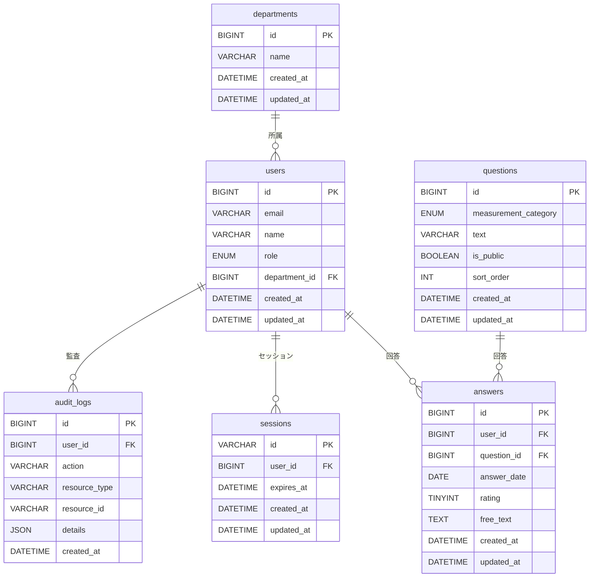

# 基本設計書

## 1. 概要

### 1.1 ドキュメントの目的

本ドキュメントは、要件定義書で定義した機能・非機能要件を実現するための基本設計を記述する。

### 1.2 参照ドキュメント

- 要件定義書（本設計書は要件定義書の機能・非機能要件を実現する）

### 1.3 適用範囲

- 本設計書は基本設計（概要設計）の範囲とし、詳細設計（画面仕様書、API仕様書、DB定義書等）は別ドキュメントで管理する

---

## 2. システム構成

### 2.1 アーキテクチャ概要

- **構成方式**: SPA + REST API、3層アーキテクチャ
- **フロントエンド**: React（SPA）、ブラウザで動作
- **バックエンド**: FastAPI（REST API）、ビジネスロジック・データアクセスを担当
- **データ層**: MySQL（永続化・セッションストア）
- **認証**: Google Workspace OAuth 2.0（認証はGoogle側、セッションは自前管理）

### 2.2 システム構成図

```text
[ブラウザ]                    [社内ネットワーク]
    |                                  |
    |  HTTPS                           |
    v                                  v
[React SPA] -----> [FastAPI] -----> [MySQL]
    |                  |                  +-- 回答データ（暗号化）
    |                  |                  +-- セッション
    |                  |                  +-- 監査ログ
    |
    +---> [Google OAuth 2.0] (認証)
```

### 2.3 技術スタック

| レイヤー | 技術 | バージョン目安 | 備考 |
|----------|------|----------------|------|
| フロントエンド | React | 18.x | SPA、対応ブラウザは要件定義書に準拠 |
| バックエンド | FastAPI | 0.100+ | REST API、非同期対応 |
| データベース | MySQL | 8.0+ | 永続化・セッション（sessions テーブル）、有効期限8時間 |
| 認証 | Google OAuth 2.0 | - | 社内Google Workspaceドメインに限定 |

---

## 3. 画面設計

### 3.1 共通レイアウト

認証後の全画面で共通のレイアウトを適用する。

```text
+--------------------------------------------------+
| ヘッダー（ロゴ / ナビゲーション / ユーザー名 / ログアウト） |
+--------------------------------------------------+
|                                                  |
|  メインコンテンツエリア                          |
|  （画面ごとに内容が切り替わる）                  |
|                                                  |
+--------------------------------------------------+
```

#### 共通コンポーネント

| コンポーネント | 説明 |
|----------------|------|
| ヘッダー | アプリ名またはロゴを左側に配置 |
| ナビゲーション | 回答入力、回答履歴（従業員）/ 質問管理、集計（管理者）へのリンク。権限に応じて表示を切り替え |
| ユーザー情報 | ログインユーザー名を表示 |
| ログアウト | クリックでセッション削除、ログイン画面へ遷移 |

### 3.2 画面遷移図

```text
                    [ログイン画面]
                           |
              +------------+------------+
              |            |            |
              v            v            v
    [回答入力画面]  [質問管理画面]  [集計ダッシュボード]
              |            |            |
              |            |            |
              v            |            |
    [回答履歴・編集画面]   |            |
              |            |            |
              +------------+------------+
                     （共通ヘッダーから遷移）
```

- 未認証時: ログイン画面のみ表示
- 認証後: ロールに応じて初期表示画面を決定（従業員→回答入力、管理者→集計ダッシュボードまたは質問管理）
- 全画面: 共通ヘッダーから他画面へ遷移可能（権限がある場合）

### 3.3 画面一覧・詳細

#### 3.3.1 ログイン画面

| 項目 | 内容 |
|------|------|
| 画面ID | LOGIN-001 |
| 概要 | Google Workspaceアカウントによる認証 |
| 遷移元 | なし（未認証時） |
| 遷移先 | 回答入力画面 / 質問管理画面 / 集計ダッシュボード（権限に応じて） |

##### ログイン画面のレイアウト

```text
+------------------------------------------+
|                                          |
|              [アプリ名]                  |
|                                          |
|         [Googleでログイン]               |
|                                          |
+------------------------------------------+
```

- 中央に「Googleでログイン」ボタンを配置
- クリックでGoogle OAuth認証画面へリダイレクト
- 認証成功後、ロールに応じて初期画面へ遷移

#### 3.3.2 回答入力画面

| 項目 | 内容 |
|------|------|
| 画面ID | ANSWER-001 |
| 概要 | 5段階評価・自由記述の入力 |
| 対象 | 従業員 |
| 遷移元 | ログイン後、回答履歴画面 |
| 遷移先 | 回答履歴・編集画面 |

##### 回答入力画面の入力項目

| 項目 | 必須 | 型 | 説明 |
|------|------|-----|------|
| 回答日 | ○ | 日付 | 対象期間（日付） |
| 質問ごとの5段階評価 | ○ | 1〜5 | 各質問に対する評価 |
| 質問ごとの自由記述 | - | テキスト | 任意、文字数制限は別途定義 |

##### 回答入力画面のレイアウト

```text
+----------------------------------------------+
| 回答日: [日付選択]                           |
+----------------------------------------------+
| 質問1: ○1 ○2 ○3 ○4 ○5                   |
| 質問2: ○1 ○2 ○3 ○4 ○5                   |
| 質問3: ○1 ○2 ○3 ○4 ○5                   |
| カスタム質問1: 自由記述[     ]               |
| ...                                          |
+----------------------------------------------+
|              [保存] [キャンセル]             |
+----------------------------------------------+
```

#### 3.3.3 回答履歴・編集画面

| 項目 | 内容 |
|------|------|
| 画面ID | ANSWER-002 |
| 概要 | 過去の回答一覧・編集 |
| 対象 | 従業員 |
| 遷移元 | 回答入力画面、共通ヘッダー |
| 遷移先 | 回答入力画面（編集時） |

##### 回答履歴・編集画面のレイアウト・表示・操作

```text
+------------------------------------------+
| 期間: [開始日] 〜 [終了日] [検索]        |
+------------------------------------------+
| 回答日    | 質問数 | 操作                |
| 2024-01-15| 3件   | [編集]               |
| 2024-01-08| 3件   | [編集]               |
| ...                                      |
+------------------------------------------+
```

- 回答日付で一覧表示（新しい順）
- 各行から編集を実行可能（自ユーザーの回答のみ）
- 期間フィルタで絞り込み可能
- 管理者は同一画面で自ユーザーの回答履歴を閲覧可能（他ユーザー分は集計ダッシュボードで集計値として参照）

#### 3.3.4 質問管理画面

| 項目 | 内容 |
|------|------|
| 画面ID | ADMIN-001 |
| 概要 | 質問の追加・編集・公開/非公開 |
| 対象 | 管理者 |
| 遷移元 | 共通ヘッダー |
| 遷移先 | なし（編集は同一画面内でモーダルまたはインライン編集） |

##### 質問管理画面のレイアウト・表示・操作

```text
+-------------------------------------------+
| [質問を追加]                              |
+-------------------------------------------+
| カテゴリ | 質問文      | 公開 | 順 | 操作 |
| 満足度   | 仕事に...   | ○   | 1  | [編集][削除][公開切替] |
| 人間関係 | 同僚と...   | ○   | 2  | [編集][削除][公開切替] |
| ...                                       |
+-------------------------------------------+
```

- 質問一覧（測定項目カテゴリ、質問文、公開状態、表示順）
- 追加・編集・削除・公開/非公開の切り替え
- 表示順の並び替え（ドラッグ&ドロップまたは上下ボタン）

#### 3.3.5 集計ダッシュボード

| 項目 | 内容 |
|------|------|
| 画面ID | ADMIN-002 |
| 概要 | 部署別・期間別の集計表示 |
| 対象 | 管理者 |
| 遷移元 | 共通ヘッダー |
| 遷移先 | なし（同一画面内でフィルタ変更） |

##### 集計ダッシュボードのレイアウト・表示・操作

```text
+-------------------------------------------+
| 期間: [日/週/月] 部署: [複数選択] [反映]  |
+-------------------------------------------+
| 5段階評価の平均（質問ごと）               |
| [棒グラフまたは表]                        |
+-------------------------------------------+
| 自由記述一覧（要約表示）                  |
| [一覧テーブル]                            |
+-------------------------------------------+
```

- 期間フィルタ: 日/週/月で切り替え
- 部署フィルタ: 部署選択（複数選択可）
- 集計結果: 5段階評価の平均・分布、自由記述の一覧（要約表示）

### 3.4 バリデーション・エラー表示

| 項目 | 方針 |
|------|------|
| 必須項目 | 未入力時は送信不可、該当フィールドにエラー表示 |
| 5段階評価 | 1〜5の範囲外はエラー |
| 日付 | 未来日はエラー（回答日は当日以前に限定） |
| エラー表示 | フィールド直下または画面上部にメッセージ表示 |
| API エラー | 403/500 等はトーストまたはモーダルで通知 |

### 3.5 レスポンシブ・アクセシビリティ

- **レスポンシブ**: 要件定義書に準じ、デスクトップ利用を主とする（必須としない）
- **アクセシビリティ**: フォーカス順序、キーボード操作の基本対応を推奨

---

## 4. データベース設計

### 4.1 ER図



- users: 部署に属する（department_id、部署マスタが外部の場合は参照用IDのみ保持）
- answers: ユーザーと質問の組み合わせ、**UNIQUE(user_id, question_id, answer_date)** で一意（1ユーザー・1質問・1日につき1回答）
- audit_logs: user_id は NULL 許容（未認証時のログ記録用）。**更新・削除はトリガーにより禁止**

### 4.2 テーブル定義

#### 4.2.1 部署（departments）

部署マスタが他システムで管理される場合は、同期用または参照用として利用。自前管理する場合は本テーブルを使用。

| カラム名 | 型 | NULL | 説明 |
|----------|-----|------|------|
| id | BIGINT UNSIGNED | NO | 主キー、AUTO_INCREMENT |
| name | VARCHAR(100) | NO | 部署名 |
| created_at | DATETIME | NO | 作成日時 |
| updated_at | DATETIME | NO | 更新日時 |

#### 4.2.2 ユーザー（users）

| カラム名 | 型 | NULL | 説明 |
|----------|-----|------|------|
| id | BIGINT UNSIGNED | NO | 主キー、AUTO_INCREMENT |
| email | VARCHAR(255) | NO | Google Workspaceメールアドレス、UNIQUE |
| name | VARCHAR(100) | YES | 表示名 |
| role | ENUM('employee','admin') | NO | ロール（従業員/管理者） |
| department_id | BIGINT UNSIGNED | YES | 部署ID、FK→departments |
| created_at | DATETIME | NO | 作成日時 |
| updated_at | DATETIME | NO | 更新日時 |

**インデックス**: email (UNIQUE), department_id

#### 4.2.3 質問（questions）

質問は各測定項目とは別に個別の質問事項として設定可能（要件定義書 4.1）。

| カラム名 | 型 | NULL | 説明 |
|----------|-----|------|------|
| id | BIGINT UNSIGNED | NO | 主キー、AUTO_INCREMENT |
| measurement_category | ENUM | NO | 満足度/人間関係/健康 |
| text | VARCHAR(500) | NO | 質問文 |
| is_public | BOOLEAN | NO | 公開フラグ、デフォルトTRUE |
| sort_order | INT UNSIGNED | NO | 表示順、デフォルト0 |
| created_at | DATETIME | NO | 作成日時 |
| updated_at | DATETIME | NO | 更新日時 |

**インデックス**: (is_public, sort_order)

※ measurement_category: ENUM('satisfaction','relationship','health')

- satisfaction=仕事の満足度, relationship=人間関係, health=健康状態

#### 4.2.4 回答（answers）

| カラム名 | 型 | NULL | 説明 |
|----------|-----|------|------|
| id | BIGINT UNSIGNED | NO | 主キー、AUTO_INCREMENT |
| user_id | BIGINT UNSIGNED | NO | ユーザーID、FK→users |
| question_id | BIGINT UNSIGNED | NO | 質問ID、FK→questions |
| answer_date | DATE | NO | 回答日 |
| rating | TINYINT UNSIGNED | YES | 5段階評価（1〜5） |
| free_text | TEXT | YES | 自由記述、保存時暗号化 |
| created_at | DATETIME | NO | 作成日時 |
| updated_at | DATETIME | NO | 更新日時 |

**制約**: UNIQUE(user_id, question_id, answer_date)

**インデックス**: (user_id, answer_date), (question_id, answer_date)（集計用）

#### 4.2.5 監査ログ（audit_logs）

| カラム名 | 型 | NULL | 説明 |
|----------|-----|------|------|
| id | BIGINT UNSIGNED | NO | 主キー、AUTO_INCREMENT |
| user_id | BIGINT UNSIGNED | YES | ユーザーID（未認証時はNULL） |
| action | VARCHAR(50) | NO | 操作種別（後述の監査ログ一覧を参照） |
| resource_type | VARCHAR(50) | YES | 対象リソース種別 |
| resource_id | VARCHAR(100) | YES | 対象リソースID |
| details | JSON | YES | 詳細（IP、User-Agent、変更内容等） |
| created_at | DATETIME | NO | 発生日時 |

**インデックス**: (user_id, created_at), (action, created_at)

#### 4.2.6 セッション（sessions）

| カラム名 | 型 | NULL | 説明 |
|----------|-----|------|------|
| id | VARCHAR(64) | NO | セッションID（主キー） |
| user_id | BIGINT UNSIGNED | NO | ユーザーID、FK→users |
| expires_at | DATETIME | NO | 有効期限 |
| created_at | DATETIME | NO | 作成日時 |
| updated_at | DATETIME | NO | 更新日時 |

**インデックス**: (expires_at)（期限切れセッションの定期削除用）

---

## 5. API設計

### 5.1 API一覧

| メソッド | パス | 概要 | 認証 |
|----------|------|------|------|
| GET | /api/auth/me | ログインユーザー情報取得 | 必須 |
| POST | /api/auth/logout | ログアウト | 必須 |
| GET | /api/questions | 質問一覧取得（公開中のみ） | 必須 |
| GET | /api/admin/questions | 質問一覧取得（全件） | 管理者 |
| POST | /api/admin/questions | 質問登録 | 管理者 |
| PUT | /api/admin/questions/:id | 質問更新 | 管理者 |
| DELETE | /api/admin/questions/:id | 質問削除 | 管理者 |
| PATCH | /api/admin/questions/:id/visibility | 公開/非公開切り替え | 管理者 |
| PUT | /api/admin/questions/reorder | 表示順一括更新 | 管理者 |
| GET | /api/answers | 回答一覧取得（自ユーザー） | 必須 |
| POST | /api/answers | 回答登録（一括） | 必須 |
| PUT | /api/answers/:id | 回答更新 | 必須 |
| GET | /api/admin/aggregations | 集計データ取得 | 管理者 |
| GET | /api/admin/departments | 部署一覧取得 | 管理者 |

### 5.2 API詳細

#### GET /api/auth/me

- **レスポンス**: ユーザー情報（id, email, name, role, department_id）
- **エラー**: 401 未認証

#### POST /api/answers（回答登録）

- **リクエスト**: answer_date, answers[]（question_id, rating, free_text）
- **レスポンス**: 登録された回答一覧
- **バリデーション**: rating は 1〜5、同一日付・同一質問の重複登録は更新扱い

#### GET /api/admin/aggregations

- **クエリ**: `period=day|week|month`, `start_date`, `end_date`, `department_ids[]`
- **レスポンス**: 部署別・期間別の集計（平均評価、分布、自由記述件数等）

### 5.3 エラー形式

- **共通**: `{ "error": { "code": "ERROR_CODE", "message": "メッセージ" } }`
- **HTTPステータス**: 400 バリデーション、401 未認証、403 権限不足、404 未検出、500 サーバーエラー

---

## 6. 認証・認可設計

### 6.1 認証フロー

1. ユーザーが「Googleでログイン」をクリック
2. Google OAuth 2.0 認証画面へリダイレクト
3. 認証成功後、コールバックURLへリダイレクト（認可コード付き）
4. バックエンドでトークン交換、ユーザー情報取得
5. 初回ログイン時は users テーブルに登録（メールドメインが社内ドメインであることを検証）
6. セッションIDを発行し、sessions テーブルに保存、Cookie で返却
7. 以降のリクエストは Cookie のセッションIDで認証

### 6.2 認可（権限）

| ロール | 回答登録 | 回答履歴 | 質問管理 | 集計閲覧 |
|--------|----------|----------|----------|----------|
| 従業員 (employee) | ○ | ○（自ユーザーのみ） | × | × |
| 管理者 (admin) | ○ | ○ | ○ | ○ |

### 6.3 セッション管理

- **セッションストア**: MySQL（sessions テーブル）
- **有効期限**: 8時間（最終アクセスから更新、または固定8時間は要検討）
- **Cookie**: HttpOnly, Secure, SameSite=Lax
- **手動ログアウト**: セッション削除、Cookie 無効化

---

## 7. セキュリティ設計

### 7.1 データ保護

- **回答データ**: free_text カラムを保存時暗号化（AES-256-GCM 等）
- **通信**: HTTPS 必須（TLS 1.2 以上）
- **秘密情報**: 環境変数で管理、リポジトリにコミットしない

### 7.2 監査ログ

| 対象操作 | action 値 | 記録項目 |
|----------|-----------|----------|
| ログイン成功 | login_success | user_id, IP, User-Agent |
| ログイン失敗 | login_fail | email（試行時）, IP, 理由 |
| 質問の変更 | question_create/update/delete | user_id, resource_id, 変更内容 |
| 質問の公開状態変更 | question_visibility_change | user_id, resource_id, 変更後状態 |
| 集計の閲覧 | aggregation_view | user_id, フィルタ条件 |

### 7.3 改ざん防止

- 監査ログは追記専用、更新・削除不可
- ログの整合性検証は運用方針で定義（ハッシュチェーン等は将来検討）

---

## 8. 非機能要件への対応

### 8.1 性能

- **レスポンス目標**: 通常操作 2秒以内
- **集計ダッシュボード**: 5秒以内
  - インデックス: (question_id, answer_date), (user_id, answer_date)
  - 必要に応じて集計結果のキャッシュを検討
- **N+1 クエリ**: 一覧取得時は JOIN または バッチ取得で回避

### 8.2 可用性

- 社内業務時間帯（平日 8:00〜20:00）の稼働を想定
- 計画メンテナンスは事前通知の上で実施
- MySQL 障害時: セッション切れにより再ログインが必要になることを許容

### 8.3 運用・保守

| 項目 | 方針 |
|------|------|
| ログローテーション | アプリケーションログ: 日次ローテーション、30日保持。監査ログ: 別途運用方針で定義 |
| バックアップ | MySQL: 日次フルバックアップ、保持期間は運用方針で定義（セッション含む） |
| 監視 | アプリケーションの死活監視、DB の接続監視 |
| 障害復旧 | 復旧手順書を整備、RTO/RPO は運用方針で定義 |

---

## 9. 改訂履歴

| 版 | 日付 | 変更内容 | 担当 |
|----|------|----------|------|
| 0.1 | - | 初版作成 | - |
